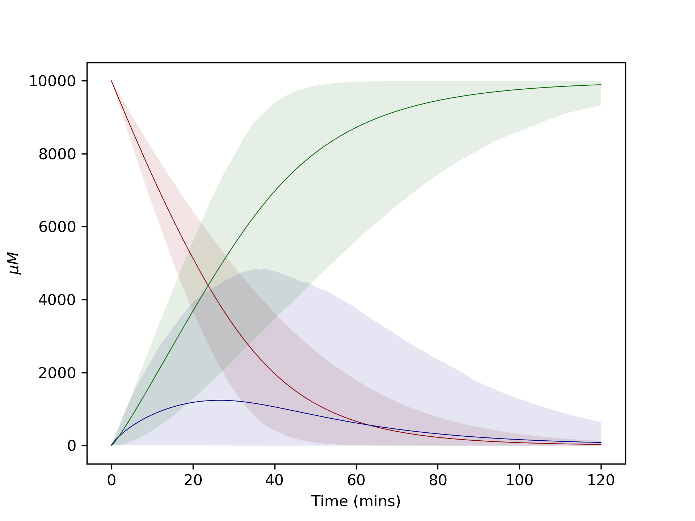

=================
Advanced Tutorial
=================

This tutorial uses the same example as the simple tutorial, but demonstrates the use of probability distributions rather than single parameter values.

Again I recommend running this using a jupyter notebook or google colab.

Here is a direct link to this example in google colab.
Or here is a direct link to this workbook in google colab.
https://colab.research.google.com/github/willfinnigan/kinetics/blob/master/examples/Advanced_example.ipynb

.. image:: images/example_system.png
   :scale: 20
   :alt: graphical abstract

Define reactions with uncertain parameters
------------------------------------------
We can describe the uncertainty we have for a parameter using a probability distribution.

Where parameters have been characterised, resulting in a standard error, we can use this to describe a normal distribution.

Where we roughly know where a parameter is, but don't want to make any suggestion as to more or less likley values, we can use a uniform distribution.

Where we have absolutely no idea what value a parameter takes, we can use a log-uniform distribution (reciprocal) to describe it was being equally as likely to be within a number of orders of magnitude.

Log-normal distributions can also be used.  A recent paper describes how log-normal distributions can be created taking into account numerous literature values.

To use these probability distributions in our modelling, we can employ the probability distributions available through `scipy
<https://docs.scipy.org/doc/scipy/reference/stats.html>`_.

Define our reactions as before, but this time we specify reaction.parameter_distributions.  Make sure to import these from scipy.

.. code:: python

    import kinetics
    from scipy.stats import reciprocal, uniform, norm

    # Define reactions
    enzyme_1 = kinetics.Uni(kcat='enz1_kcat', kma='enz1_km', enz='enz_1', a='A',
                            substrates=['A'], products=['B'])

    enzyme_1.parameter_distributions = {'enz1_kcat' : norm(100,12),
                                        'enz1_km' : uniform(2000, 6000)}

    enzyme_2 = kinetics.Uni(kcat='enz2_kcat', kma='enz2_km', enz='enz_2', a='B',
                            substrates=['B'], products=['C'])

    enzyme_2.parameter_distributions = {'enz2_kcat' : norm(30, 5),
                                        'enz2_km' : reciprocal(1,10000)}

Next we define our model as before.

.. code:: python

    # Set up the model
    model = kinetics.Model()
    model.append(enzyme_1)
    model.append(enzyme_2)
    model.set_time(0, 120, 1000)

We can include uncertainty in some or all of the starting species concentrations.
Here we have specified uncertainty in the enzyme concentraions using a normal distribution with a standard deviation of 5% of the starting value.
We have specified no uncertainty in the starting concentration of A.

.. code:: python

    # Set starting concentrations
    model.species = {"A" : 10000}
    model.species_distributions = {"enz_1" : norm(4, 4*0.05),
                                   "enz_2" : norm(10, 10*0.05)}
    model.setup_model()

Running the model with a single set of parameter values
-------------------------------------------------------
We can run the model exactly as in the simple example, and we will get a single prediction for each substrate.
Running the model this way will use the mean of each probability distribution specified, unless a different value is specified.

.. code:: python

    model.run_model()
    model.plot_substrate('A')
    model.plot_substrate('B')
    model.plot_substrate('C', plot=True)

.. image:: images/simple_example1.png
   :scale: 25
   :alt: example plot

Running the model by sampling within the probability distributions
------------------------------------------------------------------
However we would like to run lots of models, sampling within our probability distributions.

To generate samples from within the distributions we have defined, run ``kinetics.sample_distributions(model, num_samples=1000)``.
This returns a set of samples which can be used by ``kinetics.run_all_models(model, samples)``.

``kinetics.run_all_models(model, samples)`` will return a list of outputs.  Each entry in this list is equivalent to ``model.y`` after running ``model.run_model()``.

.. code:: python

    # Run the model 1000 times, sampling from distributions
    samples = kinetics.sample_distributions(model, num_samples=1000)
    outputs = kinetics.run_all_models(model, samples, logging=True)

Plotting the data
-----------------
To deal with the large amount of data this generates, two functions are available to generate a dictionary containing dataframes for each species in the model.

``dataframes_all_runs(model, output)`` will return dataframes containing every single run.

``dataframes_quartiles(model, output, quartile=95)`` will return dataframes containing a High, Low and Mean value, based on whatever quartile is specified (default=95%).

These dataframes can then be exported for further use, or can be used to generate plots.

Plotting graphs with confidence intervals
~~~~~~~~~~~~~~~~~~~~~~~~~~~~~~~~~~~~~~~~~

Plotting the 95% confidence intervals can look neater, but we lose some information on the outliers by doing this.

.. code:: python

    # Plot model runs at 95% CI
    ci_dataframes = kinetics.dataframes_quartiles(model, outputs)
    kinetics.plot_ci_intervals(['A', 'B', 'C'], ci_dataframes, colours=['blue', 'darkorange', 'green'], plot=True)

Plotting graphs showing all runs (spagetti plots)
~~~~~~~~~~~~~~~~~~~~~~~~~~~~~~~~~~~~~~~~~~~~~~~~~

Alternatively we can plot every single run.  With 1000 runs this can look a bit chaotic, and it may be clearer to plot each substrate on its own graph.
Also, altering the alpha and linewidth values allows the graphs to be tweaked to preference.

.. code:: python

    # Plot all model runs
    all_runs_dataframes = kinetics.dataframes_all_runs(model, outputs)
    kinetics.plot_substrate('A', all_runs_dataframes, colour='blue', alpha=0.01, linewidth=5)
    kinetics.plot_substrate('B', all_runs_dataframes, colour='darkorange', alpha=0.01, linewidth=5)
    kinetics.plot_substrate('C', all_runs_dataframes, colour='green', alpha=0.01, linewidth=5, plot=True)

.. image:: images/advanced_example2.png
   :scale: 25
   :alt: example plot

Of course the dataframes are also available to be used as the output, possibly to create your own graphs or for other analysis.

Complete code
-------------

.. code:: python

    import kinetics
    import matplotlib.pyplot as plt
    from scipy.stats import reciprocal, uniform, norm
    %config InlineBackend.figure_format ='retina'

    # Define reactions
    enzyme_1 = kinetics.Uni(kcat='enz1_kcat', kma='enz1_km', enz='enz_1', a='A',
                            substrates=['A'], products=['B'])

    enzyme_1.parameter_distributions = {'enz1_kcat' : norm(100,12),
                                        'enz1_km' : uniform(2000, 6000)}

    enzyme_2 = kinetics.Uni(kcat='enz2_kcat', kma='enz2_km', enz='enz_2', a='B',
                            substrates=['B'], products=['C'])

    enzyme_2.parameter_distributions = {'enz2_kcat' : norm(30, 5),
                                        'enz2_km' : reciprocal(1,10000)}

    # Set up the model
    model = kinetics.Model(logging=False)
    model.append(enzyme_1)
    model.append(enzyme_2)
    model.set_time(0, 120, 1000)

    # Set starting concentrations
    model.species = {"A" : 10000}
    model.species_distributions = {"enz_1" : norm(4, 4*0.05),
                                   "enz_2" : norm(10, 10*0.05)}
    model.setup_model()

    # Run the model 1000 times, sampling from distributions
    samples = kinetics.sample_distributions(model, num_samples=1000)
    outputs = kinetics.run_all_models(model, samples, logging=True)

    model.run_model()
    model.plot_substrate('A')
    model.plot_substrate('B')
    model.plot_substrate('C', plot=True)

    # Plot model runs at 95% CI
    ci_dataframes = kinetics.dataframes_quartiles(model, outputs)
    kinetics.plot_ci_intervals(['A', 'B', 'C'], ci_dataframes, colours=['blue', 'darkorange', 'green'])
    plt.show()

    # Plot all model runs
    all_runs_dataframes = kinetics.dataframes_all_runs(model, outputs)
    kinetics.plot_substrate('A', all_runs_dataframes, colour='blue', alpha=0.01, linewidth=5)
    kinetics.plot_substrate('B', all_runs_dataframes, colour='darkorange', alpha=0.01, linewidth=5)
    kinetics.plot_substrate('C', all_runs_dataframes, colour='green', alpha=0.01, linewidth=5)
    plt.show()

