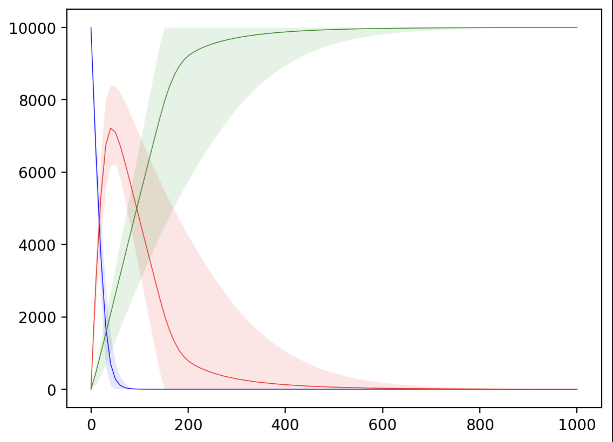
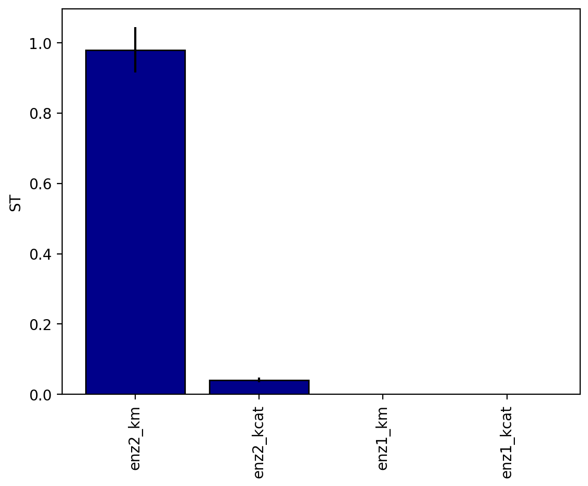
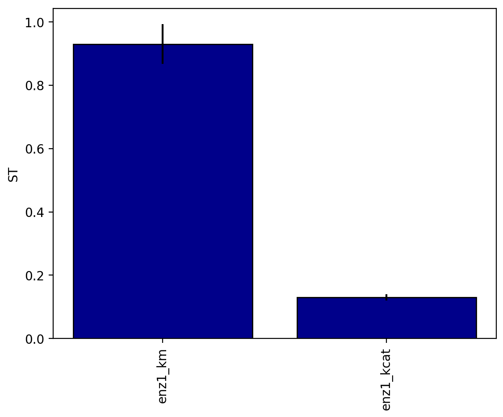

====================
Sensitivity Analysis
====================

This tutorial demonstrates how to perform sensitivity analysis on enzyme kinetic models using the kinetics package. Sensitivity analysis helps identify which parameters have the most influence on your model outputs.

Overview
--------

The sensitivity analysis uses **Sobol indices** to quantify parameter importance:

* **S1**: First-order sensitivity (direct effect of each parameter)
* **ST**: Total sensitivity (includes interaction effects with other parameters)

Basic Two-Enzyme Pathway Example
---------------------------------

Let's analyze a simple two-enzyme pathway: A → B → C

.. code-block:: python

    import kinetics
    import numpy as np
    from kinetics import (SalibSaltelliSampler, 
                          analyze_sensitivity_at_timepoint, 
                          analyze_sensitivity_time_to_concentration)

    # Step 1: Define the enzymatic reactions
    enzyme_1 = kinetics.Uni(
        kcat='enz1_kcat', 
        kma='enz1_km', 
        enz='enz_1', 
        a='A',
        substrates=['A'], 
        products=['B']
    )

    enzyme_2 = kinetics.Uni(
        kcat='enz2_kcat', 
        kma='enz2_km', 
        enz='enz_2', 
        a='B',
        substrates=['B'], 
        products=['C']
    )

    # Step 2: Define parameter distributions for uncertainty analysis
    # Format: (min_value, max_value)
    enzyme_1.parameter_distributions = {
        'enz1_kcat': (90, 110),      # kcat varies from 90-110 s⁻¹
        'enz1_km': (2000, 6000)      # Km varies from 2000-6000 µM
    }

    enzyme_2.parameter_distributions = {
        'enz2_kcat': (25, 35),       # kcat varies from 25-35 s⁻¹
        'enz2_km': (1, 10000)        # Km varies from 1-10000 µM (log scale)
    }

    # Step 3: Set up the model
    model = kinetics.Model()
    model.set_time(0, 1000, 100)  # 0-1000 seconds, 100 time points
    model.add_reaction(enzyme_1)
    model.add_reaction(enzyme_2)

    # Step 4: Configure the sampler
    # SalibSaltelliSampler uses Saltelli sampling for Sobol analysis
    sampler = SalibSaltelliSampler(
        num_samples=1000,              # Number of samples (more = better statistics)
        log_parameters=['enz2_km']     # Parameters to sample on log scale
    )

    # Step 5: Run the multi-parameter simulation
    solver = kinetics.SciPySolver()
    initial_conditions = {
        "A": 10000,    # 10 mM substrate A
        "enz_1": 5,    # 5 µM enzyme 1
        "enz_2": 2     # 2 µM enzyme 2
    }

    result = model.run_multi(initial_conditions, sampler, solver)

    result.plot('A')
    result.plot('B')
    result.plot('C')
    plt.show()

Analysis 1: Sensitivity at Specific Timepoint
----------------------------------------------

Analyze which parameters most influence the concentration of species B at t=200 seconds:

.. code-block:: python

    # Analyze sensitivity for [B] at t=500 seconds
    sa_result = analyze_sensitivity_at_timepoint(
        result=result,
        sampler=sampler,
        species='B',
        timepoint=200,
        threshold=0
    )

    # Display results
    print("Sensitivity Analysis for [B] at t=200s:")
    print(sa_result.data)

    # Visualize results
    sa_result.plot()

Expected output::

    Sensitivity Analysis for [B] at t=200s:
                    S1   S1_conf        ST   ST_conf
    enz1_kcat -0.000038  0.000539  0.000034  0.000006
    enz1_km   -0.000071  0.000922  0.000136  0.000024
    enz2_kcat  0.017103  0.017343  0.041190  0.006786
    enz2_km    0.954835  0.107375  0.979004  0.064452

Analysis 2: Time to Reach Target Concentration
-----------------------------------------------

Analyze which parameters most influence the time to reach 50 µM or less of species A:

.. code-block:: python

    # Analyze sensitivity for time to reach [A] = 50 µM
    sa_result = kinetics.analyze_sensitivity_time_to_concentration(
        result=result,
        sampler=sampler,
        species='A',
        concentration=50,
        mode='<=',       # Time to reach or be less than concentration
        threshold=0
    )

    print("Sensitivity Analysis for time to reach [A] = 50 µM:")
    print(sa_result.data)

    # Visualize results
    sa_result.plot()

Expected output::

    Sensitivity Analysis for time to reach [A] = 50 µM:
                    S1   S1_conf        ST   ST_conf
    enz1_kcat  0.081237  0.032020  0.129793  0.010073
    enz1_km    0.866165  0.078412  0.929434  0.062554

Interpreting Results
--------------------

Sobol Indices
~~~~~~~~~~~~~

* **S1 (First-order)**: Direct effect of the parameter
* **ST (Total)**: Total effect including interactions
* **Difference (ST - S1)**: Interaction effects with other parameters

Key Insights
~~~~~~~~~~~~

* Higher values = greater parameter importance
* S1 ≈ ST suggests minimal parameter interactions
* ST >> S1 indicates strong parameter interactions
* Parameters below threshold are filtered out

Confidence Intervals
~~~~~~~~~~~~~~~~~~~~

* ``S1_conf`` and ``ST_conf`` show uncertainty in sensitivity estimates
* Increase ``num_samples`` for tighter confidence intervals

Advanced Usage
--------------

Using SALib for Sensitivity Analysis
~~~~~~~~~~~~~~~~~~~~~~~~~~~~~~~~~~~~

The sensitivity analysis functionality is powered by `SALib (Sensitivity Analysis Library) <https://salib.readthedocs.io/>`_, 
a Python library for performing global sensitivity analysis. SALib provides robust methods for:

* **Sobol Analysis**: Variance-based sensitivity analysis
* **Saltelli Sampling**: Efficient sampling scheme for Sobol indices
* **Parameter Space Exploration**: Comprehensive parameter uncertainty analysis

For more information on sensitivity analysis methods and theory, visit the `SALib documentation <https://salib.readthedocs.io/>`_.