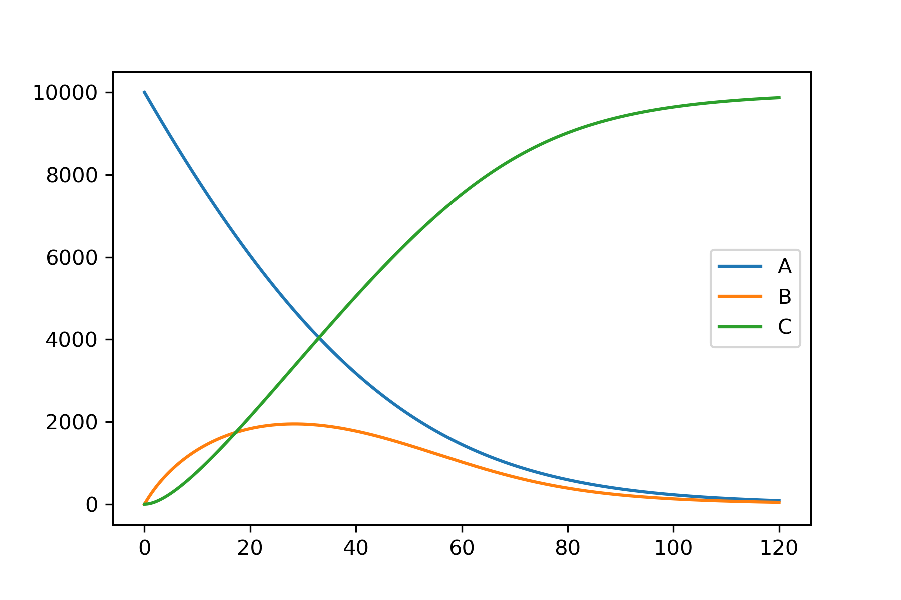

===============
Simple Tutorial
===============
I recommend running this using a jupyter notebook.

Alternatively use a `google colab
<https://colab.research.google.com/>`_.
notebook to get started quickly. (Use ``!pip install kinetics`` in the first cell)

This example shows the code required to model the relatively simple system shown on the main page.
The complete example as a single block of code is available at the end.

.. image:: images/example_system.png
   :scale: 20
   :alt: graphical abstract

Define reactions
----------------
The first step in building a kinetic model is to define rate equations which describe the rates of the reactions in a system.
Rate equations will typically contain rate constants, referred to as parameters here, and species concentrations.
Each rate equation which needs to be included in the model should be set up as a reaction object, as shown below.

In this example, a pair of single substrate irreversible enzyme reactions which follow Michaelis-Menton kinetics are shown:

.. code:: python

    import kinetics

    enzyme_1 = kinetics.Uni(kcat='enz1_kcat', kma='enz1_km',
                            enz='enz_1', a='A',
                            substrates=['A'], products=['B'])

    enzyme_1.parameters = {'enz1_kcat' : 100,
                           'enz1_km' : 8000}

    enzyme_2 = kinetics.Uni(kcat='enz2_kcat', kma='enz2_km',
                            enz='enz_2', a='B',
                            substrates=['B'], products=['C'])

    enzyme_2.parameters = {'enz2_kcat' : 30,
                           'enz2_km' : 2000}

When setting up reactions, parameter names (``kcat='enz1_kcat', kma='enz1_km'``) and species names (``enz='enz_1', a='A',``) are first given.
These are used by the reaction when calculating the rate.
A list of substrates which are used up in the reaction, and products that are made in the reaction is the specified (``substrates=['A'], products=['B']``).

Most of the common enzyme mechanisms are pre-defined in the package.  For more information see Reactions (link).

Next we need to add these reactions to a model.

Define the model
----------------
The model class is central to the kinetics package.
It is essentially a list to which we append our reactions, with some extra variables and functions to run the model.

.. code:: python

    import kinetics

    # Initiate a new model
    model_one = kinetics.Model()

Add reactions to the model
~~~~~~~~~~~~~~~~~~~~~~~~~~
The reactions we defined above are appended to the model.

.. code:: python

    # Append our reactions.
    model_one.append(enzyme_1)
    model_one.append(enzyme_2)

Set how long the model will simulate
~~~~~~~~~~~~~~~~~~~~~~~~~~~~~~~~~~~~

The time that a model will simulate can be set by using:

.. code:: python

    # Set the model to run from 0 to 120 minutes, over 1000 steps
    model_one.set_time(0, 120, 1000)

Set starting species concentrations
~~~~~~~~~~~~~~~~~~~~~~~~~~~~~~~~~~~
The model defaults all starting species to 0, for anything defined in the reactions.
For the model to predict anything useful, we need to give it starting concentrations (including the enzymes).
Only species which are greater than 0 need to be defined here.

.. code:: python

    # Set starting concentrations
    model_one.species = {"A" : 10000,
                         "enz_1" : 4,
                         "enz_2" : 10}

Run the model
~~~~~~~~~~~~~
Once everything is set, run ``model_one.setup_model()`` followed by ``model_one.run_model()``.
A dataframe containing the simulation results is then available using ``model_one.results_dataframe()``.
Alternatively, results can plotted directly using an in-built plot function ``model_one.plot_substrate('A')``.

.. code:: python

    # Setup and run the model
    model_one.setup_model()
    model_one.run_model()

    # Plot the results
    model_one.plot_substrate('A')
    model_one.plot_substrate('B')
    model_one.plot_substrate('C', plot=True)

Complete code
-------------
All the code in this example in one handy block.

.. code:: python

    # Uncomment and run this if using google colab
    # !pip install kinetics

    import kinetics
    import matplotlib.pyplot as plt
    %config InlineBackend.figure_format ='retina'

    # Define reactions
    enzyme_1 = kinetics.Uni(kcat='enz1_kcat', kma='enz1_km', enz='enz_1', a='A',
                            substrates=['A'], products=['B'])

    enzyme_1.parameters = {'enz1_kcat' : 100,
                           'enz1_km' : 8000}

    enzyme_2 = kinetics.Uni(kcat='enz2_kcat', kma='enz2_km', enz='enz_2', a='B',
                            substrates=['B'], products=['C'])

    enzyme_2.parameters = {'enz2_kcat' : 30,
                           'enz2_km' : 2000}

    # Set up the model
    model_one = kinetics.Model(logging=False)
    model_one.append(enzyme_1)
    model_one.append(enzyme_2)
    model_one.set_time(0, 120, 1000) # 120 mins, 1000 timepoints.

    # Set starting concentrations
    model_one.species = {"A" : 10000,
                         "enz_1" : 4,
                         "enz_2" : 10}
    model_one.setup_model()

    # Run the model
    model_one.run_model()
    model_one.plot_substrate('A')
    model_one.plot_substrate('B')
    model_one.plot_substrate('C', plot=True)

    # Now try altering the enzyme concentration, km or kcat, and re-running the model to see the effects this has....

