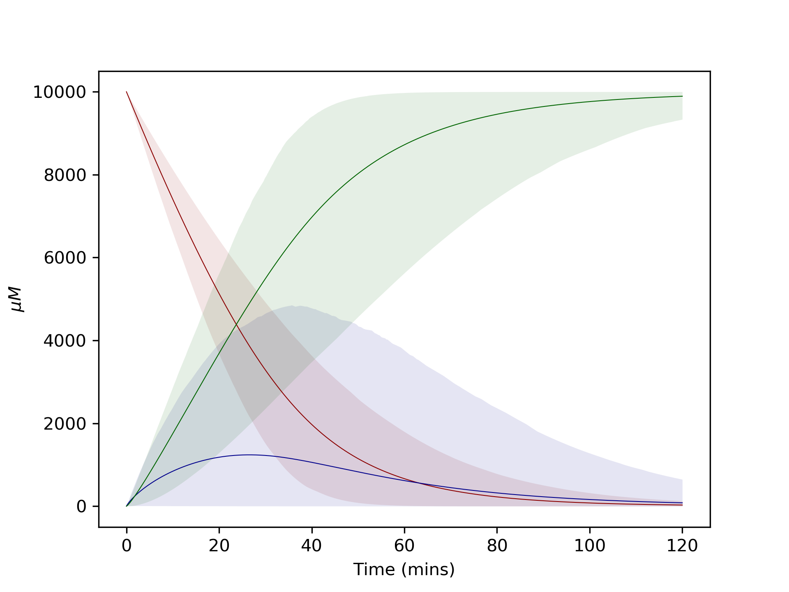
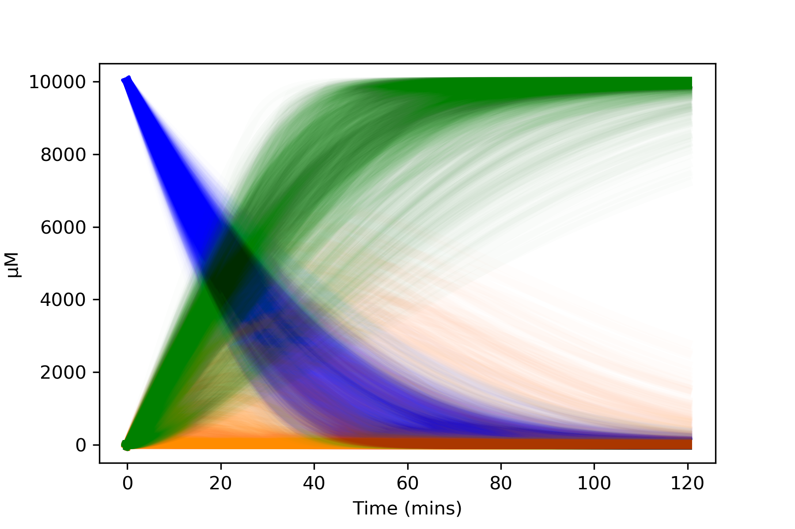

============================================
Uncertain parameters - SALib bounds tutorial
============================================

This tutorial demonstrates an alternative approach to parameter uncertainty using SALib bounds instead of scipy probability distributions. This method is particularly useful for sensitivity analysis and when you want to explore parameter space without making distributional assumptions.

Again I recommend running this using a jupyter notebook or google colab.

.. image:: images/example_system.png
   :scale: 20
   :alt: graphical abstract

SALib bounds approach
---------------------

Instead of using scipy probability distributions, you can specify parameter uncertainty using simple bounds (min and max values). This approach is particularly useful when you want to:

- Perform sensitivity analysis using SALib
- Specify uncertainty as ranges without assuming specific distributions
- Use Latin Hypercube sampling for better coverage of parameter space
- Avoid making assumptions about the shape of parameter distributions

**Understanding the underlying distributions:**

When using this approach, parameters are specified as ``[min, max]`` pairs. Under the hood, this creates:

- **Uniform distributions** for parameters sampled in normal space
- **Log-uniform (reciprocal) distributions** for parameters sampled in log space

**Key advantages of this approach:**

1. **Latin Hypercube Sampling**: Efficiently and evenly samples the parameter space, ensuring better coverage than random sampling
2. **Sensitivity Analysis**: Results can be directly used with SALib methods to perform global sensitivity analysis
3. **Simplicity**: Only requires specifying bounds rather than choosing specific distribution shapes

You can specify whether parameters should be sampled in log space, which is useful for parameters that vary over several orders of magnitude (creating log-uniform/reciprocal distributions).

Define reactions with parameter bounds
--------------------------------------

Instead of using scipy distributions, we define parameter bounds as simple two-element lists:

.. code:: python

    import kinetics

    # Define reactions
    enzyme_1 = kinetics.Uni(kcat='enz1_kcat', kma='enz1_km', enz='enz_1', a='A',
                            substrates=['A'], products=['B'])

    # Use bounds instead of distributions: [min, max]
    enzyme_1.parameter_distributions = {'enz1_kcat': [80, 120],     # kcat between 80-120
                                        'enz1_km': [2000, 8000]}    # km between 2000-8000

    enzyme_2 = kinetics.Uni(kcat='enz2_kcat', kma='enz2_km', enz='enz_2', a='B',
                            substrates=['B'], products=['C'])

    # For parameters varying over orders of magnitude, we'll sample in log space
    enzyme_2.parameter_distributions = {'enz2_kcat': [25, 35],      # kcat between 25-35
                                        'enz2_km': [1, 10000]}      # km between 1-10000 (log space)

Set up the model and use SALib sampling
----------------------------------------

Now we use the SALib sampler instead of the scipy sampler:

.. code:: python

    # Set up the model
    model = kinetics.Model()
    model.add_reaction(enzyme_1)
    model.add_reaction(enzyme_2)
    model.set_time(0, 120, 1000)

    # Set starting concentrations (mix of fixed values and bounds)
    species_dict = {"A": 10000,
                    "enz_1": [3.8, 4.2],    # enzyme 1 concentration between 3.8-4.2
                    "enz_2": [9.5, 10.5]}   # enzyme 2 concentration between 9.5-10.5

    # Create SALib sampler with Latin Hypercube sampling
    # Specify which parameters should be sampled in log space
    sampler = kinetics.SalibLatinHypercubeSampler(num_samples=1000, 
                                                  log_parameters=['enz2_km'])
    
    # Run the model
    result = model.run_multi(species_dict, sampler)

Running the model with a single set of parameter values
-------------------------------------------------------

We can run the model exactly as in the other tutorials, and we will get a single prediction for each substrate.
Running the model this way will use the mean of each parameter bound specified, unless a different value is specified.

.. code:: python

    single_result = model.run_single(species_dict)
    single_result.plot('A')
    single_result.plot('B')
    single_result.plot('C')

.. image:: images/simple_example1.png
   :scale: 25
   :alt: example plot

Plotting the data
-----------------

The plotting and analysis methods are identical to the scipy distribution approach:

.. code:: python

    # Plot model runs with 95% confidence intervals
    result.plot('A', quartile=95)
    result.plot('B', quartile=95)
    result.plot('C', quartile=95)
    plt.show()

    # Plot all individual model runs
    result.plot_all('A')
    result.plot_all('B')
    result.plot_all('C')
    plt.show()

Benefits of the SALib bounds approach
-------------------------------------

- **Efficient sampling**: Latin Hypercube sampling ensures even and efficient coverage of the parameter space, avoiding clustering of samples that can occur with random sampling
- **Uniform and log-uniform distributions**: Automatically creates uniform distributions (normal space) or log-uniform/reciprocal distributions (log space) from simple bounds
- **Sensitivity analysis ready**: Results can be directly used with SALib methods to perform global sensitivity analysis using techniques like Sobol indices
- **Log-space sampling**: Easily handle parameters that vary over orders of magnitude by specifying them in the log_parameters list
- **No distributional assumptions**: You only need to specify min/max bounds rather than choosing specific distribution shapes
- **Simpler specification**: Just specify bounds rather than having to select and parameterize probability distributions

When to use each approach
-------------------------

**Use scipy distributions when:**
- You have specific knowledge about parameter distributions (e.g., from experimental data)
- You want to incorporate measurement uncertainty with known standard errors
- You need specific distribution shapes (normal, log-normal, etc.)

**Use SALib bounds when:**
- You want to explore parameter space without distributional assumptions
- You're performing sensitivity analysis
- You have rough estimates of parameter ranges
- You want better coverage of parameter space with Latin Hypercube sampling

Complete code
-------------

.. code:: python

    import kinetics
    import matplotlib.pyplot as plt
    %config InlineBackend.figure_format ='retina'

    # Define reactions with parameter bounds
    enzyme_1 = kinetics.Uni(kcat='enz1_kcat', kma='enz1_km', enz='enz_1', a='A',
                            substrates=['A'], products=['B'])

    enzyme_1.parameter_distributions = {'enz1_kcat': [80, 120],     # kcat between 80-120
                                        'enz1_km': [2000, 8000]}    # km between 2000-8000

    enzyme_2 = kinetics.Uni(kcat='enz2_kcat', kma='enz2_km', enz='enz_2', a='B',
                            substrates=['B'], products=['C'])

    enzyme_2.parameter_distributions = {'enz2_kcat': [25, 35],      # kcat between 25-35
                                        'enz2_km': [1, 10000]}      # km between 1-10000 (log space)

    # Set up the model
    model = kinetics.Model()
    model.add_reaction(enzyme_1)
    model.add_reaction(enzyme_2)
    model.set_time(0, 120, 1000)

    # Set starting concentrations (mix of fixed values and bounds)
    species_dict = {"A": 10000,
                    "enz_1": [3.8, 4.2],    # enzyme 1 concentration between 3.8-4.2
                    "enz_2": [9.5, 10.5]}   # enzyme 2 concentration between 9.5-10.5

    # Run a single model first with mean values
    single_result = model.run_single(species_dict)
    single_result.plot('A')
    single_result.plot('B')
    single_result.plot('C')

    # Run the model 1000 times using SALib Latin Hypercube sampling
    sampler = kinetics.SalibLatinHypercubeSampler(num_samples=1000, 
                                                  log_parameters=['enz2_km'])
    multi_result = model.run_multi(species_dict, sampler)

    # Plot model runs with 95% confidence intervals
    multi_result.plot('A', quartile=95)
    multi_result.plot('B', quartile=95)
    multi_result.plot('C', quartile=95)
    plt.show()

    # Plot all individual model runs
    multi_result.plot_all('A')
    multi_result.plot_all('B')
    multi_result.plot_all('C')
    plt.show()

Alternative samplers
--------------------

SALib also provides other sampling methods. For sensitivity analysis, you might want to use Saltelli sampling:

.. code:: python

    # Use Saltelli sampling for sensitivity analysis
    sampler = kinetics.SalibSaltelliSampler(num_samples=1000, 
                                            log_parameters=['enz2_km'])
    result = model.run_multi(species_dict, sampler)

Saltelli sampling generates more samples than Latin Hypercube sampling but is specifically designed for global sensitivity analysis using Sobol indices.