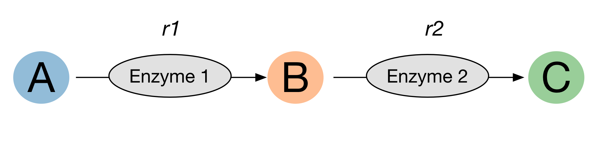
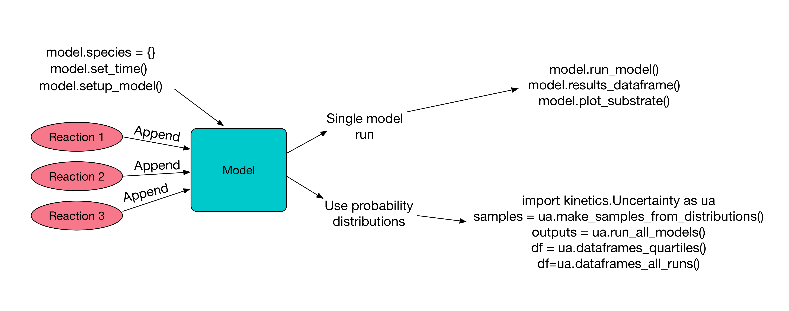

=================================
Why, What and How to build models
=================================

What is a model?
----------------
In the cases of the deterministic kinetic models this package deals with,
a model is a set of ordinary differential equations (ODEs),
which describe changes in substrate concentrations over time.
Essentially a model is answering the question: "how fast will my reaction go?"

To define the rate at which substrates concentrations change over time, we define rate laws.

The most well known of these is the Michaelis-Menton equation.  A--enz-->B
Our rate law would be:

.. math::
    rate = \frac{c_{enz}\cdot k_{cat}\cdot c_{A}}{c_{A}+K_{M}^{A}}

And our Ordinary Differential Equations (ODEs) are:

.. math::
    \frac{dA}{dt} = -rate

.. math::
    \frac{dB}{dt} = +rate

Keep in mind that using Michaelis-Menton kinetics we are making the steady-state assumption, among others.
For more on this see:
`Reaction Chemical Kinetics in Biology, N. J. Harmer, M. Vivoli Vega, in Biomol. Bioanal. Tech. (Ed.: V. Ramesh), 2019, pp. 179–217
<https://onlinelibrary.wiley.com/doi/10.1002/9781119483977.ch9>`__

Why build a model?
------------------
A model is simply a mathematical description for what an experimenter ‘thinks’ will happen in a reaction.
For single enzymes, relatively simple mental or back-of-the-envelope models are often sufficient.
For example, it is fairly obvious in the majority of cases that more enzyme results in a faster reaction.
However, as we begin to build more complicated multi-enzyme reactions,
the increasing complexity of these systems requires a more methodical approach.
Constructing a kinetic model allows the dynamics of such a system to be investigated in silico,
and to ask questions such as, more of which enzyme gives a faster reaction?

How to build a model?
---------------------
The simple and advanced tutorials in this documentation deal with how to use the kinetics package to build models of reactions.

However, before writing the code we need to understand which reactions we need to model, and the mechanisms behind them.

A good first step is to draw a reaction scheme such as:

From this (albeit simple) example, we can see we need rate equations for enzyme 1 and enzyme 2.

The next step is to identify the mechanism of these enzymes.  In this case both enymes take a single substrate,
so can be modelled using either the uni-irreversible or the uniuni-reversible rate equations (see section on reactions).

Where multiple substrates are present (as is common), more options are available to pick from.
Literature is a good place to find the appropriate mechanism for you enzyme, from which you can identify which rate equation to use.

Having found the appropriate rate equations, follow either the simple or advanced tutorials to model your system using this package.

Conceptual diagram for how this package works
---------------------------------------------

