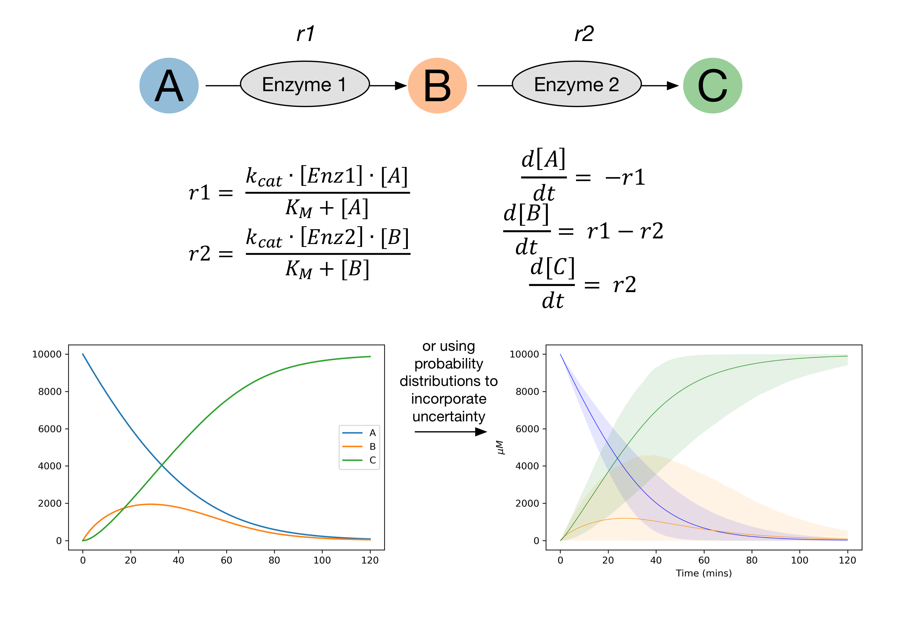

kinetics
========

kinetics is a package for modelling reactions using ordinary differential equations.
It's primarily aimed at modelling enzyme reactions, although can be used for other purposes.

kinetics uses scipy.integrate.odeint to solve ordinary differential equations,
but extends upon this to allow the use of parameter distributions rather than single parameter values.
This allows error to be incorporated into the modelling.

kinetics uses `scipy's probability distributions <https://docs.scipy.org/doc/scipy/reference/stats.html/>`_, with a large number of distributions to choose from.
Typically uniform , normal, log-uniform or log-normal distributions are used.

Features
--------
- Construct systems of ODEs simply by selecting suitable rate equations and naming parameters and species.
- Use either simple parameter values or probability distributions.
- Run sensitivity analysis using SALib
- Easily plot model runs using predefined plotting functions

.. toctree::
   :maxdepth: 2

   Installation
   Simple Tutorial
   Advanced Tutorial
   Reactions
   API

Support
-------
wjafinnigan@gmail.com or william.finnigan@manchester.ac.uk

License
-------
The project is licensed under the MIT license.
